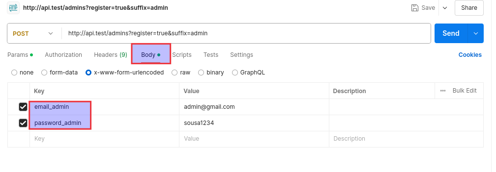

## Crear nuevo Workspace
Llamarlo `FMS`
Y crear un folder (Collection) solo para las apis del sistema fms, llamarla API FMS.
Abrir nueva pestaña POST
El end point de nuestra app es: http://api.test

Para construir el end point para poder registrar a un admin user, ver la documentación en pagina 21 solicitudes de tipo POST. Siempre la primer variable GET se pone despues de un `?` y ya después se usa el `&`, dar a POSTMAN la url http://api.test/admins.
Tenemos que construir:
`http://api.test/admins?register=true&suffix=admin`
Al ir agregando los parámetros en POSTMAN vemos como se va construyendo nuestro url.

## API DATA
